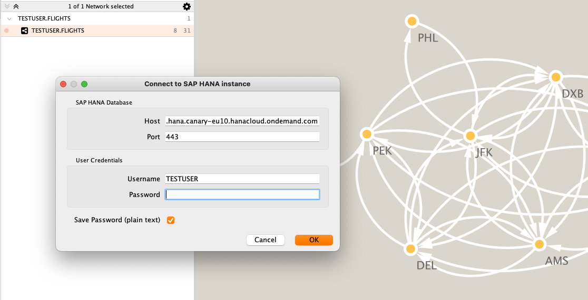
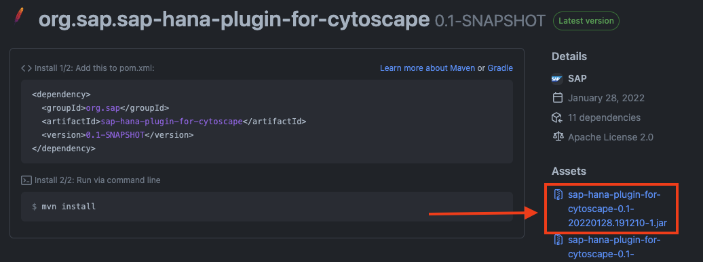
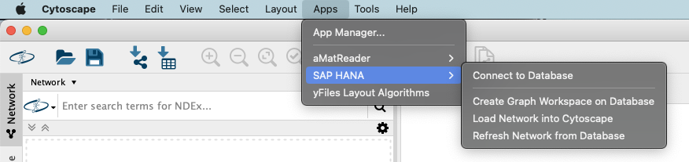
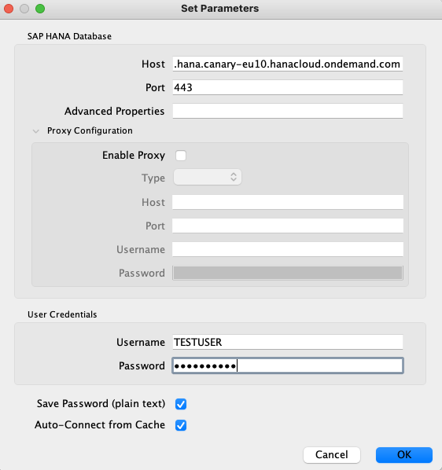
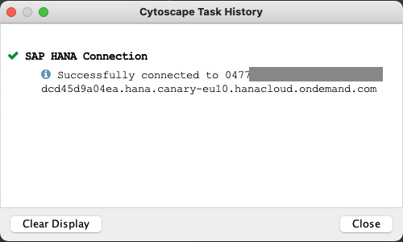
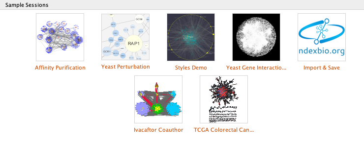
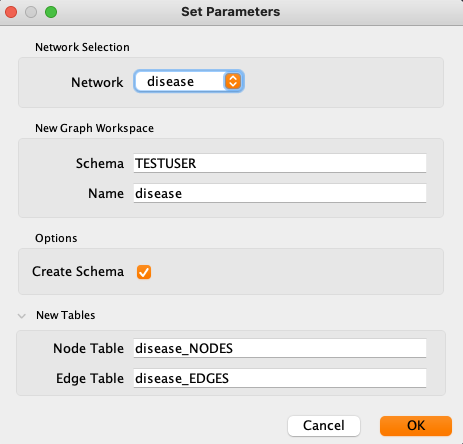
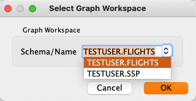
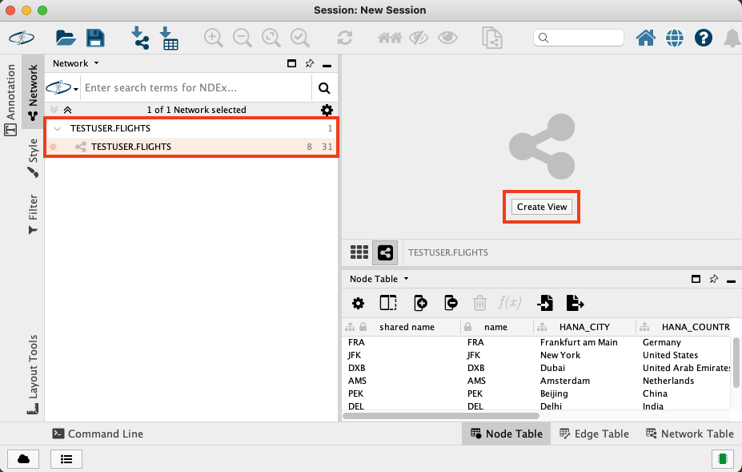
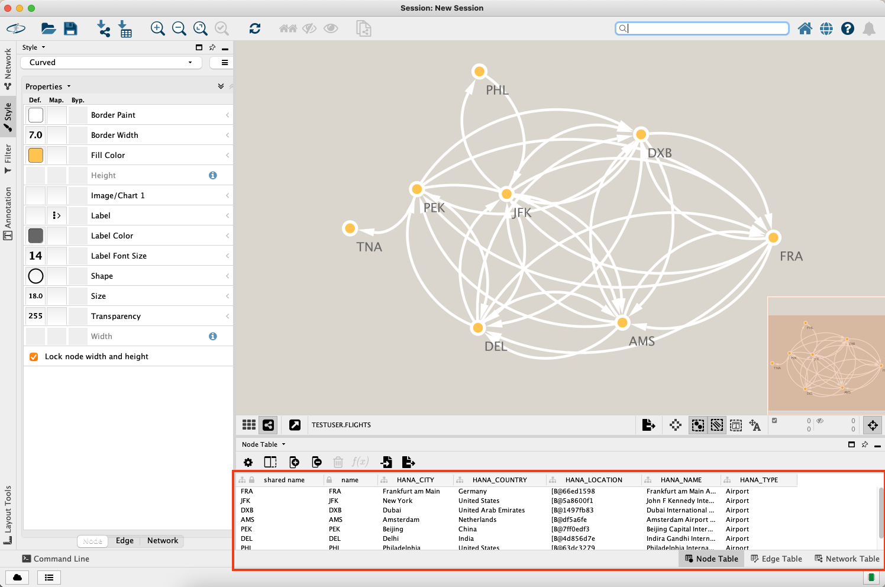

# SAP HANA plug-in for Cytoscape
## Description
The SAP HANA plug-in for Cytoscape is an app to connect Cytoscape to [SAP HANA Graph](https://help.sap.com/viewer/11afa2e60a5f4192a381df30f94863f9/2021_2_QRC/en-US/30d1d8cfd5d0470dbaac2ebe20cefb8f.html). The current version delivers a basic integration for interacting with Graph Workspaces on SAP HANA.

## Requirements
The plugin is tested to work with [Cytoscape 3.9.0](https://cytoscape.org/), [SapMachine 11](https://sap.github.io/SapMachine/) and the latest [NGDBC Driver](https://tools.hana.ondemand.com/#hanatools).

## Functionalities
The current feature scope comprises:
- Establish connection to SAP HANA (Cloud)
- Upload a Network to SAP HANA (Cloud)
- Download an existing (homogeneous) graph workspace to Cytoscape
- Refresh a downloaded workspace in the client

## Downlaod and Installation
### Download
The latest (bleeding edge) package can be downloaded in the [packages section](https://github.com/SAP/sap-hana-plugin-for-cytoscape/packages). Check the `Assets` list for the latest jar file.

### Setup
After getting the latest JAR package, you can install the plugin using the [Cytoscape App Manager](http://manual.cytoscape.org/en/stable/App_Manager.html). 

The plugin makes use of the SAP HANA JDBC client, which additionally needs to be included on the classpath. The latest version can be retrieved from the [SAP Development Tools](https://tools.hana.ondemand.com/#hanatools) (look for [ngdcb-latest.jar](https://tools.hana.ondemand.com/additional/ngdbc-latest.jar)).

On a Mac, you can copy `ngdbc-latest.jar` to `/Applications/Cytoscape_vX.X.X/framework/lib/openjfx/mac`. A similar folder exists on Windows machines within the Cytoscape installation.

After installation, you should be able to find the plugin under `Apps` > `SAP HANA`.

## Usage
### Establishing a Connection to SAP HANA (Cloud)
To establish a connection to SAP HANA (Cloud), you will need to enter host, port, username and your password. The credentials will be cached locally in the user folder to make future connections more convenient.

For even more convenience and at the cost of security, you can optionally store the password. 

> Please be aware, that your password will be stored as plain text!

You can check the task history of Cytoscape to verify, that the connection has been established successfully.

### Upload a Network to SAP HANA
To upload a network, you first need to connect to your instance of SAP HANA as described above. Also, you need to have at least one network existing in Cytoscape.

> If you need a dataset to start testing, you can use one of Cytoscapes samples, that are available on the starter panel. Following screenshots will use the `disease` dataset from the sample session `Styles Demo`.

To upload a network to SAP HANA, choose the respective entry in the apps menu.

If you have more than one network loaded in the client, you will see a dropdown list at the top of the dialog. The name of the new workspace as well as the names of node and edge table will be proposed based on the network's name.

You can manually change the proposed names. Just make sure, that none of the objects (i.e. graph workspace, node table, edge table) is already existing on the sytem.

Additionally the dialog lets you specify the target database schema. Optionally the schema will be created if it is not existing yet.
### Download an existing Graph Workspace
To download a graph workspace, you first need to connect to your instance of SAP HANA as described above. When choosing to load graph workspace, the list will already be pre-populated with all graph workspaces, that have been found on the respective system.

After choosing the respective workspace and confirming with `OK`, the nodes and edges table will be loaded into Cytoscape. Note, that it will not yet create a visualization, but only show the network on the left panel.

By choosing `Create View`, you can create an initial visualization and adapt it using Cytoscape's tools.

Note, that in the `Node Table` and `Edge Table` you can also inspect the attribute data from the respective tables in SAP HANA.

## Licensing
Copyright (2021-)2022 SAP SE or an SAP affiliate company and `sap-hana-plugin-for-cytoscape` contributors. Please see our [LICENSE](LICENSE) for copyright and license information. Detailed information including third-party components and their licensing/copyright information is available via the [REUSE tool](https://api.reuse.software/info/github.com/SAP/sap-hana-plugin-for-cytoscape).