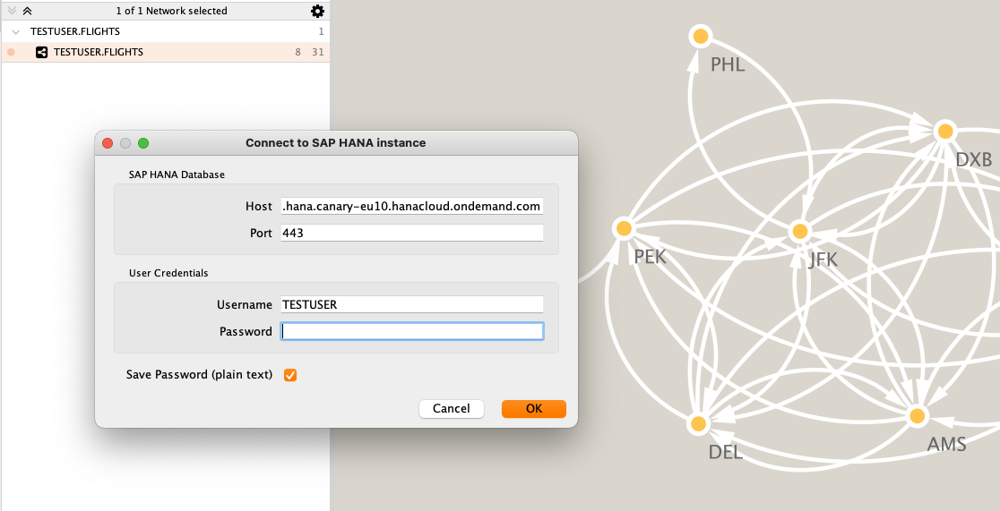
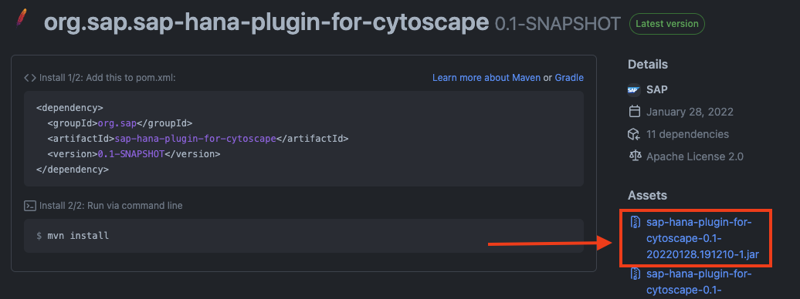
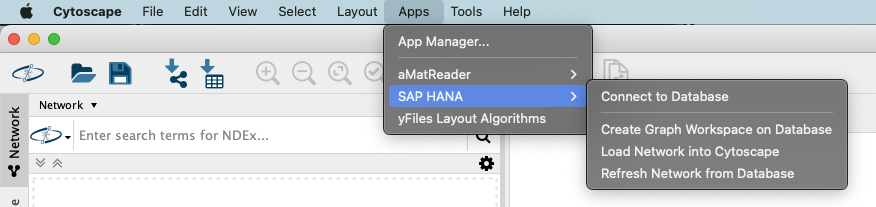
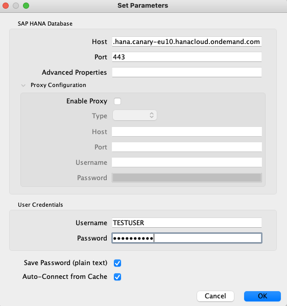
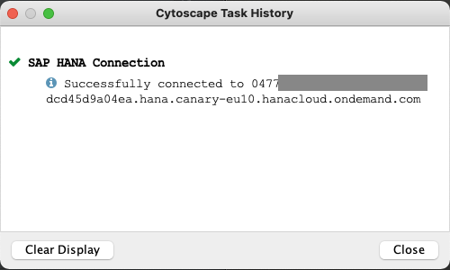
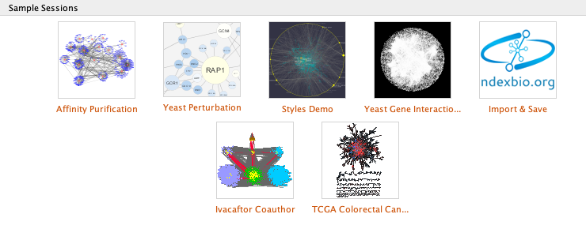
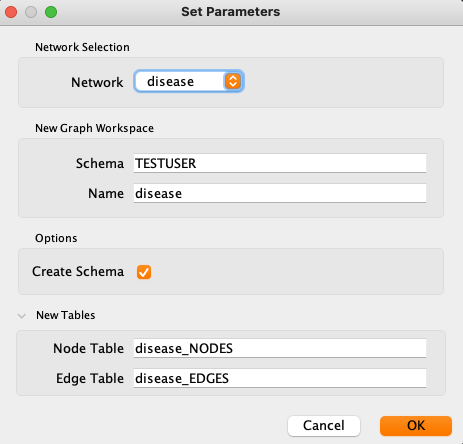
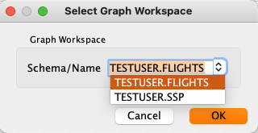
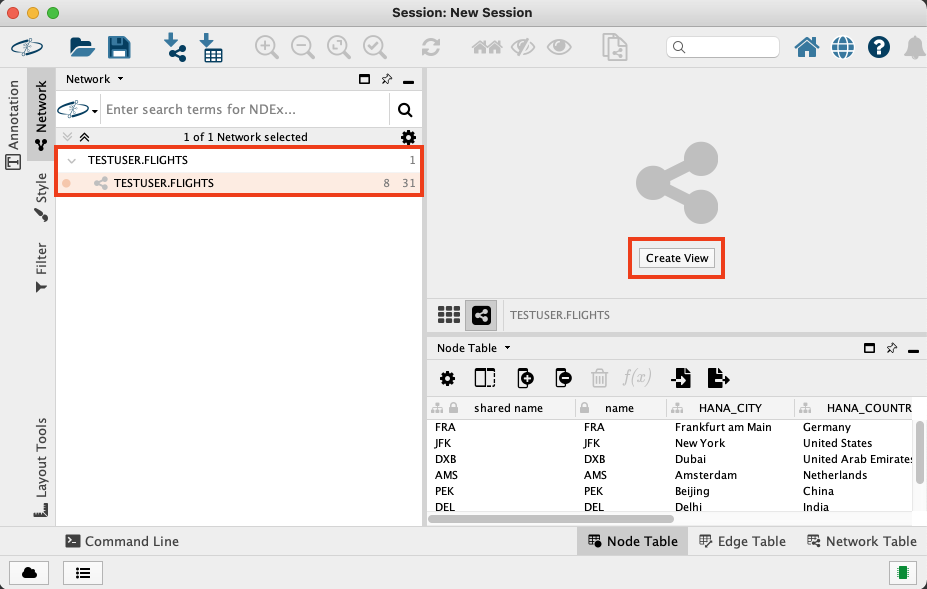
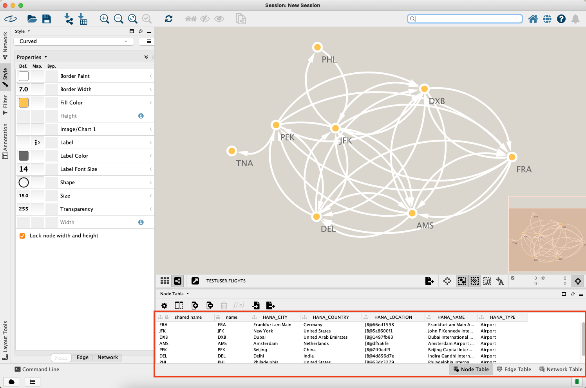

[](https://api.reuse.software/info/github.com/SAP/sap-hana-plugin-for-cytoscape)


# SAP HANA plug-in for Cytoscape
## Description
The SAP HANA plug-in for Cytoscape is an app to connect Cytoscape to the [SAP HANA (Cloud) Property Graph Engine](https://help.sap.com/docs/hana-cloud-database/sap-hana-cloud-sap-hana-database-property-graph-engine-reference/sap-hana-cloud-sap-hana-database-property-graph-engine-reference?version=latest). The current version delivers a basic integration for interacting with Graph Workspaces on SAP HANA.

## Requirements
The plug-in is tested to work with [Cytoscape 3.10.0](https://cytoscape.org/), [SapMachine 17](https://sap.github.io/SapMachine/) and the latest [NGDBC Driver](https://tools.hana.ondemand.com/#hanatools).



## Functionalities
The current feature scope comprises:
- Establish connection to SAP HANA (Cloud)
- Upload a Network to SAP HANA (Cloud)
- Download an existing (homogeneous) graph workspace to Cytoscape
- Refresh a downloaded workspace in the client

## Download and Installation via Cytoscape App Store
The easiest way to install the plug-in is directly through the [Cytoscape App Store](https://apps.cytoscape.org/apps/saphanapluginforcytoscape). Open Cytoscape, navigate to `Apps` > `App Manager`, search for **SAP HANA**, and click `Install`. After installation, the plug-in is available under `Apps` > `SAP HANA`.

## Download and Installation via GitHub
### Download
The latest (bleeding edge) package can be downloaded in the [packages section](https://github.com/SAP/sap-hana-plugin-for-cytoscape/packages). Check the `Assets` list for the latest jar file.



### Setup
After getting the latest JAR package, you can install the plug-in using the [Cytoscape App Manager](http://manual.cytoscape.org/en/stable/App_Manager.html). After installation, you should be able to find the plug-in under `Apps` > `SAP HANA`.



## Usage
### Establishing a Connection to SAP HANA (Cloud)
To establish a connection to SAP HANA (Cloud), you will need to enter host, port, username and your password. The settings will be cached locally in the user folder to make future connections more convenient.



For even more convenience and at the cost of security, you can optionally store the password.

> Please be aware that your password will be stored as plain text!

You may optionally specify a proxy configuration as well as advanced JDBC properties (format: `property1=value1;property2=value2`). The advanced JDBC properties may for example be used to specify a [Secure User Store (hdbuserstore)](https://help.sap.com/docs/SAP_HANA_PLATFORM/b3ee5778bc2e4a089d3299b82ec762a7/dd95ac9dbb571014a7d7f0234d762fdb.html?version=2.0.05).

You can check the task history of Cytoscape to verify that the connection has been established successfully.



### Upload a Network to SAP HANA
To upload a network, you first need to connect to your instance of SAP HANA as described above. Also, you need to have at least one network existing in Cytoscape.

> If you need a dataset to start testing, you can use one of Cytoscape's samples, that are available on the starter panel. Following screenshots will use the `disease` dataset from the sample session `Styles Demo`.


To upload a network to SAP HANA, choose the respective entry in the apps menu.



If you have more than one network loaded in the client, you will see a dropdown list at the top of the dialog. The name of the new workspace as well as the names of node and edge table will be proposed based on the network's name.

You can manually change the proposed names. Just make sure that none of the objects (i.e. graph workspace, node table, edge table) is already existing on the system.

Additionally the dialog lets you specify the target database schema. Optionally the schema will be created if it is not existing yet.

### Download an existing Graph Workspace
To download a graph workspace, you first need to connect to your instance of SAP HANA as described above. When choosing to load graph workspace, the list will already be pre-populated with all graph workspaces that have been found on the respective system.



After choosing the respective workspace and confirming with `OK`, the nodes and edges table will be loaded into Cytoscape. Note that it will not yet create a visualization, but only show the network on the left panel.



By choosing `Create View`, you can create an initial visualization and adapt it using Cytoscape's tools.



Note that in the `Node Table` and `Edge Table` you can also inspect the attribute data from the respective tables in SAP HANA.

### Refreshing a Network
If the underlying data in SAP HANA has changed since you last loaded a graph workspace, you can use **Refresh Network from Database** (`Apps` > `SAP HANA`) to pull in the latest state without having to reload from scratch.

The plug-in reconciles the current HANA graph workspace with the Cytoscape network:

- **Updated** nodes and edges have their attribute values refreshed to match the current HANA data.
- **New** nodes and edges (added in HANA since the last load or refresh) are added to the Cytoscape network.
- **Deleted** nodes and edges (removed from HANA since the last load or refresh) are removed from the Cytoscape network.
- Any **new attribute columns** present in HANA are automatically added to the Cytoscape node/edge tables.

> Note: Refresh is a read-only operation — it pulls changes from HANA into Cytoscape and does not modify any data in SAP HANA.

## Developer Information

### Prerequisites
- [SapMachine 17](https://sap.github.io/SapMachine/) (Java 17)
- Apache Maven 3.x
- Cytoscape 3.10.0 (for local installation and smoke-testing)

### Build
```bash
mvn verify              # full build + all tests
mvn package -DskipTests # fast build, skip tests
```
The output JAR is at `target/sap-hana-plugin-for-cytoscape-<version>.jar`.

### Running Tests
The project uses JUnit 4. Most tests run without any external dependencies. The integration tests in `HanaConnectionManagerTest` require a live SAP HANA instance — provide credentials in:
```
src/test/resources/testcredentials.properties
```
This file is git-ignored; copy the `.template` file in the same directory and fill in your instance details. If the file is absent, the integration tests are skipped automatically.

CI runs with `-DskipTests` since a live HANA instance is not available there.

### Local Installation
After building, copy the JAR into Cytoscape's apps folder and restart Cytoscape:
```bash
cp target/sap-hana-plugin-for-cytoscape-<version>.jar \
   ~/CytoscapeConfiguration/3/apps/installed/
```

## Licensing
Copyright (2021-)2026 SAP SE or an SAP affiliate company and `sap-hana-plugin-for-cytoscape` contributors. Please see our [LICENSE](LICENSE) for copyright and license information. Detailed information including third-party components and their licensing/copyright information is available via the [REUSE tool](https://api.reuse.software/info/github.com/SAP/sap-hana-plugin-for-cytoscape).
